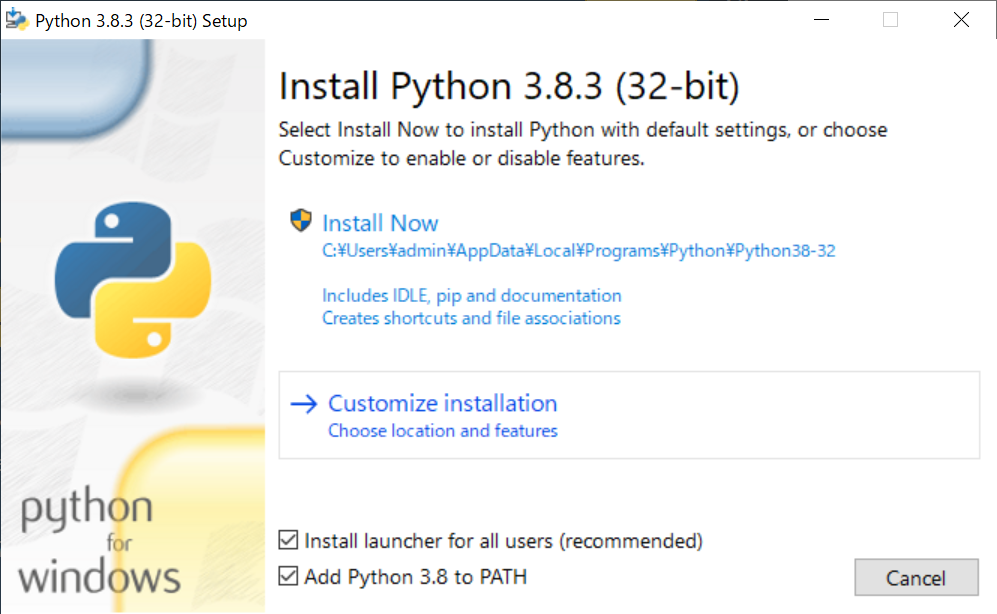

# WindowsでのPythonインストール手順

## Pythonをインストールする

はじめに、PCにPythonがインストールされているかを確認します。
スタートメニューに「command」と入力します。
コマンドプロンプトのターミナル画面を表示して、pythonと小文字で入力します。
Pythonプロンプト（`>>>`）が表示されたら、PCにはPythonがインストールされています。
pythonというコマンドが認識できないという意味のエラーメッセージが表示された場合は、Pythonがインストールされていません。

エラーだった場合またはPythonのバージョンが3.6より古かった場合は、Windows用のPythonインストーラーをダウンロードします。
https://python.org を開き、「Downloads」リンクの上にマウスカーソルを移動します。
最新バージョンのPythonのダウンロード用ボタンが表示されます。
ボタンをクリックすると、OSに対応したインストーラーのダウンロードが始まります。
ファイルのダウンロードが終了したら、インストーラーを起動します。
「Add Python 3.8 to PATH」オプションを選択することにより、システムに正しくパス
が設定されます。



## Pythonをターミナル上で動かす

ターミナル画面を開いて小文字でpythonと入力します。
Pythonプロンプト（`>>>`）が表示されます。
これは、先ほどインストールしたPythonをWindowsが見つけたことを意味します。

```
C:¥> python
Python 3.8.3 (tags/v3.8.3:6f8c832, May 13 2020, 22:20:19) [MSC v.1925 32 bit (Intel)] on win32
Type "help", "copyright", "credits" or "license" for more information.
>>>
```

対話モードを終了するには、 **Ctrl＋Z** キーと **Enter** キーを押すか、 `exit()` と入力してください。

## Sublime Textをインストールする

Sublime Textのインストーラーは、Webサイト( https://sublimetext.com/ )からダウンロードできます。
「Download」リンクをクリックし、Windows用のインストーラーを探します。
インストーラーをダウンロードしたら、実行してインストールします。設定はすべてデフォルトにします。
